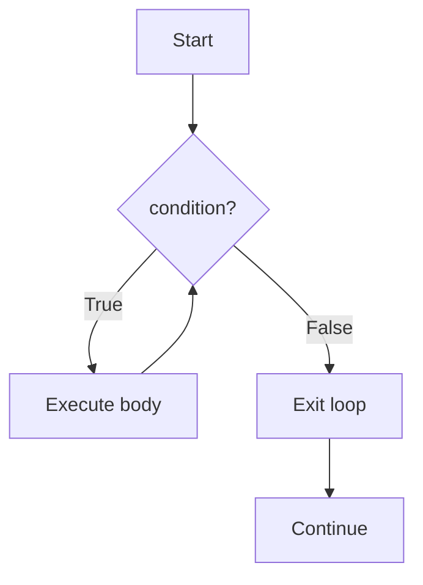

+++
title = "Lecture 3 — Control Flow"
date = 2025-01-29
weight = 1
description = "If statements, for loops, while loops, and when to use each."

[extra]
lang        = "en"
course      = "CS 101"
lecture_num = 3
math        = false
mermaid     = true
copy        = true
+++

## Slides

{{ slides(src="/slides/cs101/module2/lec03/index.html", title="Lecture 3 — Control Flow") }}

---

## Lecture Notes

### Conditionals

```python
score = 72

if score >= 90:
    grade = "A"
elif score >= 80:
    grade = "B"
elif score >= 70:
    grade = "C"
else:
    grade = "F"
```

Important: Python uses indentation to define blocks — not braces.

### The for loop

Iterates over any *iterable* object:

```python
for item in ["apple", "banana", "cherry"]:
    print(item)

for i in range(5):   # 0, 1, 2, 3, 4
    print(i)
```

### The while loop

Runs as long as a condition is true:

```python
count = 0
while count < 3:
    print(count)
    count += 1
```

### Control flow diagram



---

## Next lecture

Lecture 4 — Functions
