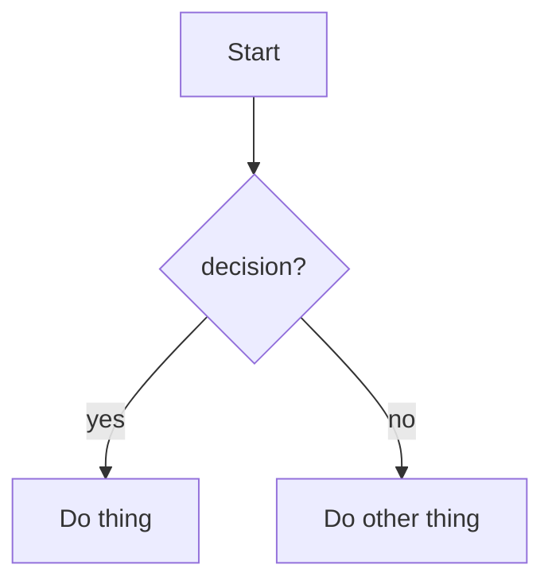
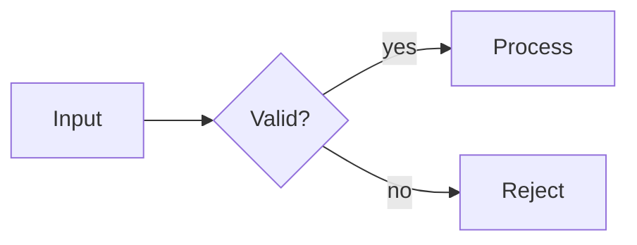

# Guide for AI agents — zola-class

This file is the **single source of truth** for any AI model, agent, or
harness that has been asked to add or modify content on the zola-class
site. Read it end-to-end before touching anything. Do not skim. Do not
guess. If something here conflicts with something you read elsewhere
(including older READMEs), **this file wins**.

The user's name is Hassan Aziz. The site lives at
<https://bauerceptor.github.io/zola-class/>. Source is at
<https://github.com/bauerceptor/zola-class>.

The companion repo is `bauerceptor.github.io` (repo1). Don't touch it
unless the user specifically asks.

---

## 0. The seven rules you must never break

1. **Never sign commits "Claude" or co-author them.** Git is configured
   with the user's identity. Just commit. Plain author. No
   `Co-Authored-By` lines. No `🤖 Generated with…` footers.
2. **Never commit without pushing.** A fix isn't a fix until it's on
   `origin/main`. The chain is always `git add -A` → `git commit -m "…"`
   → `git push`.
3. **Never edit anything under `themes/neovim-theme/`** unless you are
   re-applying one of the documented patches in §10. The theme is
   vendored — you can patch it, but every patch must be in §10.
4. **Never invent CSS values out of thin air.** Use the OKLCH tokens
   defined in `static/css/class.css` (`--nv-fg`, `--nv-accent`,
   `--nv-bg-panel`, etc.). They auto-switch with the theme system.
5. **Never disable a security/correctness rule to make a build pass.**
   If a Tera template won't compile, fix the template — don't `| safe`
   away a sanitization filter; don't disable `highlight_code`. Read §13
   for the real cause.
6. **Never reference an asset with a bare absolute path** in a Zola
   template. Use `{{ get_url(path='…') }}`. The site is deployed under
   `/zola-class/` (a subpath); `/foo` resolves to the wrong place. See
   §13.1.
7. **Never delete `content/readme.md`.** It's the target of the `:help`
   command. If you must restructure it, keep the file at the same path.

---

## 1. What the site is

- A static site, built with [Zola](https://www.getzola.org/) 0.19.2.
- Theme: a heavily-patched fork of the
  [Super-Botman/neovim-theme](https://github.com/Super-Botman/neovim-theme),
  vendored under `themes/neovim-theme/`.
- Content: class material — courses, modules, lectures, talks, slide
  decks.
- Audience: students reading lectures + curious devs poking around.
- Aesthetic: terminal/neovim layout (file tree on the left, tabbed
  content on the right) with editorial typography (Newsreader serif +
  Barlow sans + JetBrains Mono).
- Theme system: System / Light / Dark, all driven by OKLCH CSS variables.
- A WebGL aurora used to exist; it's removed. The body backdrop is now
  static (a soft radial gradient + a 40px grid SVG).

---

## 2. Directory map

```
zola-class/
├── config.toml                    Zola config (base_url, theme, [extra])
├── README.md                      Human-facing docs (don't replace casually)
├── guide-for-ai.md                This file (you are here)
├── .gitignore                     Excludes public/, .DS_Store, .claude/
├── .github/workflows/deploy.yml   CI: builds + deploys to GitHub Pages
│
├── content/                       All page content (markdown)
│   ├── _index.md                  Root section frontmatter
│   ├── readme.md                  Keyboard reference (do not delete)
│   ├── cs101/                     A course
│   │   ├── _index.md              Course frontmatter + body (syllabus, etc.)
│   │   ├── module1/
│   │   │   ├── _index.md          Module frontmatter
│   │   │   ├── lec01-intro.md     Lecture
│   │   │   └── lec02-types.md
│   │   └── module2/
│   │       ├── _index.md
│   │       └── lec03-control.md
│   └── speeches/                  A "track" (sibling of courses)
│       ├── _index.md
│       └── demo-talk.md
│
├── static/                        Copied verbatim to site root at build
│   ├── img/                       Favicons (light/dark in svg + png)
│   ├── css/
│   │   ├── class.css              All site-level overrides + tokens
│   │   ├── menu.css               Hamburger overlay menu
│   │   └── copy-btn.css           Per-codeblock copy button
│   ├── js/
│   │   ├── theme-toggle.js        System/Light/Dark cycler (loads sync)
│   │   ├── menu.js                Builds the hamburger overlay
│   │   ├── aurora.js              Legacy no-op (kept for backwards-compat)
│   │   ├── tree-fold.js           Collapsible folders in sidebar
│   │   ├── tree-visited.js        Visited-page tracking + course progress
│   │   ├── palette.js             `:` palette + Ctrl+/ guide
│   │   ├── prompt-enhance.js      Legacy bottom-prompt enhancement
│   │   └── copy-code.js           Injects "Copy" buttons on code blocks
│   ├── fonts/                     (empty placeholder)
│   └── slides/
│       ├── _themes/               SHARED slide themes (do not rename keys)
│       │   ├── clean.css          Default — Newsreader serif, auto light/dark
│       │   ├── night.css          Alternative — Playfair + Nanum, dark only
│       │   ├── terminal.css       Alternative — all JetBrains Mono
│       │   └── deck-utils.js      Copy buttons + mermaid render + key hints
│       ├── cs101/module1/lec01/index.html
│       ├── cs101/module2/lec03/index.html
│       └── speeches/demo-talk/index.html
│
├── templates/                     PROJECT templates — override the theme
│   ├── _head_extend.html          Injected into theme's <head>
│   ├── index.html                 Homepage (editorial; overrides theme)
│   ├── section.html               Course/module pages (overrides theme)
│   ├── 404.html                   Custom error page
│   └── shortcodes/
│       └── slides.html            `{{ slides(src=…) }}` shortcode
│
└── themes/neovim-theme/           VENDORED (patched) — see §10
    ├── theme.toml
    ├── templates/
    │   ├── base.html              PATCHED
    │   ├── index.html             OVERRIDDEN by templates/index.html
    │   ├── page.html              PATCHED (renders h1 + kicker + prev/next)
    │   ├── section.html           OVERRIDDEN by templates/section.html
    │   └── components/
    │       ├── files.html         PATCHED (glyphs removed)
    │       ├── tab.html
    │       └── prompt.html
    ├── sass/css/
    │   ├── base.scss              PATCHED (font URL)
    │   └── page.scss
    └── static/
        ├── js/
        │   ├── commands.js        PATCHED (window.HELP_URL)
        │   ├── index.js, prompt.js, keyboard.js, tab.js, config.js
        ├── JetBrainsMonoNLNerdFont-Regular.ttf
        └── assets/background.jpg  UNUSED (theme template skips it)
```

---

## 3. Adding content (the main reason you're here)

### 3.1 Add a new course

```bash
mkdir -p content/<course-slug>
```

Create `content/<course-slug>/_index.md`:

```markdown
+++
title       = "CS 350 — Operating Systems"
description = "Processes, memory, file systems, and the kernel as a programmable surface."
sort_by     = "weight"

[extra]
lang      = "en"
semester  = "Fall 2026"
spotlight = false      # set to true to make this the homepage's spotlight course
tagline   = "How an OS turns hardware into a programmable surface."
+++

## Course Overview

(Optional markdown body — appears below the title on the course page.)

## Syllabus

| # | Topic | Notes | Slides |
|---|-------|-------|--------|
| 1 | Processes | [Notes](module1/lec01-procs/) | — |
```

**Required frontmatter:** `title`, `description`. Everything else has
sensible defaults but should be filled.

**Only one course at a time should have `spotlight = true`.** If you set
a new one to spotlight, set the previous one to `false`. If multiple are
spotlight, the homepage picks the first one it finds.

### 3.2 Add a new module within a course

```bash
mkdir -p content/<course-slug>/module<N>
```

Create `content/<course-slug>/module<N>/_index.md`:

```markdown
+++
title       = "Module 3 — Functions and Abstraction"
description = "Procedural decomposition and named pieces of computation."
weight      = 3
+++
```

**`weight`** controls ordering. The course's `sort_by = "weight"` reads
this. Modules are conventionally numbered: `module1`, `module2`, etc.
Weight 1, 2, 3 to match.

**No body needed**, but you can add one.

### 3.3 Add a new lecture page

Create `content/<course-slug>/module<N>/lec<NN>-<short-slug>.md`:

```markdown
+++
title       = "Lecture 4 — Scheduling and Fairness"
date        = 2026-09-21
description = "Round-robin, MLFQ, lottery — and why fairness is hard."
weight      = 4

[extra]
lang        = "en"
course      = "CS 350"
lecture_num = 4
math        = false
mermaid     = false
copy        = true
+++

## Why scheduling matters

Body text in Markdown.

### Sub-section

`inline code` and code blocks render with full syntax highlighting.

```python
def schedule(processes):
    return sorted(processes, key=lambda p: p.priority)
```

> Block quotes use the theme's italic Newsreader style.

- Lists work as you'd expect.
- Add `mermaid = true` in `[extra]` if this lecture uses mermaid diagrams.
```

**Required frontmatter:** `title`. Strongly recommended: `date`,
`description`, `weight`.

**`[extra]` fields you can set:**

| Field          | Type    | Default   | Effect |
|----------------|---------|-----------|--------|
| `lang`         | string  | `"en"`    | Pass-through to `<html lang>`. |
| `course`       | string  | none      | Shown in the lecture kicker.   |
| `lecture_num`  | integer | none      | Shown in the kicker and sidebar tree. |
| `math`         | bool    | `false`   | Reserved — no math renderer wired yet. Leave `false`. |
| `mermaid`      | bool    | `false`   | **Set to `true` if and only if** the page has mermaid code fences. See §3.5. |
| `copy`         | bool    | `true`    | Whether the copy-code button should appear. Leave `true`. |

**Required body convention:** start your content at `## ` (h2). The page
title becomes the `<h1>` automatically — never write an `# h1` in the
body, you'll get two h1s on the page.

### 3.4 Add a slide deck

Slides are **standalone HTML files** under `static/slides/<path>/index.html`
that open in a new browser tab from a card on the lecture page.

**Step 1.** Pick a path that mirrors the lecture URL:

- Lecture: `content/cs350/module1/lec01-procs.md`
- Deck:    `static/slides/cs350/module1/lec01/index.html`

**Step 2.** Generate the deck from one of the Python generators (preferred
for new decks):

- `scripts/build-deck.py` is the generator for Lecture 1 / rfs-1.
- `scripts/build-deck-rfs2.py` is the generator for Lecture 2 / rfs-2.

```bash
# 1. Copy the generator to a working deck path, or edit scripts/build-deck.py directly.
mkdir -p static/slides/cs350/module1/lec01

# 2. In scripts/build-deck.py:
#    - Set OUT to the target path, e.g.
#      OUT = "static/slides/cs350/module1/lec01/index.html"
#    - Define the deck in the `sections` list.
#      * Each top-level list is a horizontal section (navigate with ←/→).
#      * Each item inside a list is a vertical sub-slide (navigate with ↑/↓).
#    - Each slide item is (data_id, title, body_html).
#      data_id must be unique. title may contain inline HTML (<code>, <em>, etc.).
#      body_html is raw HTML; use bullets([...]) and code("rust", "...").

python3 scripts/build-deck.py
```

If you prefer to hand-write HTML, copy an existing deck instead:

```bash
mkdir -p static/slides/cs350/module1/lec01
cp static/slides/dummy-reference-deck/index.html \
   static/slides/cs350/module1/lec01/index.html
```

**Step 3.** Edit the generated/new file:

- Change `<title>` to match the lecture.
- Update the slide bodies (each `<section>` inside `<div class="slides">`).
- Leave `Reveal.initialize({...})` and the bottom-right key indicator script
  alone unless you know reveal.js options.
- **The theme `<link>` href has a different number of `../` segments
  depending on the deck's depth.** For a deck 3 levels deep
  (`cs350/module1/lec01/`), use `../../../_themes/clean.css`. For 2
  levels (`speeches/demo-talk/`), use `../../_themes/clean.css`. Same
  rule for `_themes/deck-utils.js`.
- Decks generated by `build-deck.py` use `../_themes/clean.css` because they
  are kept one level under `static/slides/` (e.g. `rfs-1/`).

**Step 4.** Add the slide card to the lecture markdown:

```markdown
{{ slides(src="/slides/cs350/module1/lec01/index.html",
          title="Lec 4 — Scheduling",
          note="32 slides · 25 min") }}
```

**Shortcode params:** `src` (required, absolute-style path under
`static/`); `title` (default "Slide deck"); `note` (default "Slide deck
· opens in new tab"). The shortcode passes `src` through `get_url()`,
so leading `/` is correct.

**Available slide themes:** `clean.css` (default), `night.css`,
`terminal.css`. Change which by editing the deck's `<link rel="stylesheet">`
href. All three use the same chrome (copy buttons, navigation indicator,
help overlay) via `deck-utils.js`.

### 3.5 Mermaid diagrams

In a lecture markdown that uses mermaid:

1. Set `mermaid = true` in the page's `[extra]` block.
2. Add a fenced code block:

````markdown

````

The site's `_head_extend.html` lazy-loads mermaid only on pages where
`extra.mermaid == true`, converts `<pre><code class="language-mermaid">`
into rendered SVG, and re-renders on theme toggle.

**Gotchas:** mermaid is strict about syntax. Run any new diagram through
[mermaid live editor](https://mermaid.live) first to confirm it parses.
The current pinned version is `10.9.1` (in `templates/_head_extend.html`).

### 3.6 Code blocks

Use triple-backtick fences with a language tag:

````markdown
```python
print("Hello")
```
````

Zola is configured with `highlight_code = true` and `style = "class"`
and emits `/syntax-theme-light.css` + `/syntax-theme-dark.css` at build
time. These are wired in `_head_extend.html` and swap with the theme
toggle. **Do not change the highlighting style without updating both
files.**

If you want a fenced block to be raw (no highlighting), use
``` `text` ``` as the language.

### 3.7 Math

Not wired. Don't promise math support to the user. If they ask, the
fix is to add KaTeX or MathJax via `_head_extend.html` behind an
`extra.math` flag (mirror the mermaid pattern). Don't do this without
asking.

---

## 4. Frontmatter conventions (quick reference)

| Where           | Required          | Common optional                          |
|-----------------|-------------------|------------------------------------------|
| `_index.md` root        | `title`, `description` | `[extra] lang`              |
| Course `_index.md`      | `title`, `description`, `sort_by` | `[extra] semester, spotlight, tagline` |
| Module `_index.md`      | `title`, `weight` | `description`                            |
| Lecture `.md`           | `title`           | `date, description, weight, [extra] course, lecture_num, mermaid, copy` |

**`date` format:** `YYYY-MM-DD` as a TOML date literal (no quotes).
Anything else either won't parse or won't sort.

**Order matters in TOML:** top-level fields first, then `[extra]`
table. Putting a regular field after `[extra]` puts it INSIDE `[extra]`
silently.

---

## 5. Naming conventions

- **Course slugs**: short alphanumeric, no hyphen unless natural
  (`cs101`, `cs350`, `astro211`). Match the course code.
- **Module folders**: `module<N>` (`module1`, `module2`).
- **Lecture files**: `lec<NN>-<short-topic>.md` (`lec01-intro.md`,
  `lec04-scheduling.md`). Two-digit number for sort stability and
  visual alignment.
- **Slide deck folders**: mirror the lecture path; folder = `lec<NN>/`,
  contents always a single `index.html`.
- **Image files**: kebab-case (`schedule-diagram.png`).
- **All paths**: lowercase. Zola is case-sensitive on Linux deploys.
- **No spaces in filenames.** Use `-`.

---

## 6. The theme system

Three modes, set via the hamburger menu's button: System (follows OS),
Light, Dark. State persists in `localStorage["site-theme"]`.

Mechanism: `theme-toggle.js` adds `html.light` or `html.dark`. The CSS
in `class.css` defines all tokens under `:root` (dark defaults) and
overrides under `html.light`. Missing class = follow system via media
query.

**Token reference (read these — never invent new colors):**

| Token                       | Role                                          |
|-----------------------------|-----------------------------------------------|
| `--nv-bg-base`              | Page backdrop color                           |
| `--nv-bg-panel`             | `main`'s content panel color                  |
| `--nv-fg`                   | Primary text color                            |
| `--nv-fg-muted`             | Secondary / kicker / meta text                |
| `--nv-rule`                 | Soft divider (1px lines)                      |
| `--nv-rule-strong`          | Heavier divider                               |
| `--nv-accent`               | Primary accent (blue family)                  |
| `--nv-accent-rgb`           | `R G B` triplet — use as `rgb(var(--nv-accent-rgb) / 0.20)` for alpha |
| `--nv-accent-warm`          | Secondary accent (amber)                      |
| `--nv-accent-mint`          | Tertiary accent (teal)                        |
| `--nv-selection-bg`         | Subtle accent-tinted bg (hover states)        |
| `--nv-selection-bg-strong`  | Stronger version (selected states)            |
| `--nv-code-bg`              | Code block background                         |
| `--nv-inline-code-bg/fg`    | Inline code colors                            |
| `--nv-sidebar-w`            | Sidebar width: `clamp(240px, 24vw, 320px)`    |

**Why this matters:** when the user toggles theme, every token swaps
atomically. Hardcoded colors break under theme toggle.

---

## 7. CSS rules of the road

- **All site-level CSS goes in `static/css/class.css`.** This is loaded
  after the theme's `base.css` via `_head_extend.html`.
- **No inline `<style>` in markdown.** If you need styling for a custom
  layout, add a class to `class.css` and use it in HTML inside the
  markdown.
- **Selector specificity:** the vendored theme has many `!important`
  rules. Your overrides will need `!important` to win. Use sparingly
  and only against theme rules.
- **OKLCH everywhere.** No `#hex` for colors, no `rgb()` literals
  except inline `rgb(var(--nv-accent-rgb) / X)` for alpha. The aurora
  layer is gone; never reintroduce it without permission.
- **Animations respect `prefers-reduced-motion`.** Pattern:

  ```css
  @media (prefers-reduced-motion: reduce) {
    .my-anim { animation: none !important; opacity: 1 !important; }
  }
  ```

- **No animations on `width`, `height`, `top`, `left`, `margin`,
  `padding`.** Use `transform` and `opacity`. Per impeccable design
  laws (the "ease-out-quart / quint / expo" rule, no bounce / no
  elastic).

---

## 8. JavaScript rules

- All site-level JS lives in `static/js/`. Loaded via
  `templates/_head_extend.html`. Order:
  1. `theme-toggle.js` — **synchronous** (no `defer`), runs before paint
     to prevent FOUC.
  2. Everything else `defer`'d, in this order: menu, copy-code, aurora
     (legacy noop), tree-fold, tree-visited, prompt-enhance, palette.
- **Never load a library from CDN without lazy-loading.** The mermaid
  module is `import()`ed only when `page.extra.mermaid == true`. Follow
  that pattern.
- **Always feature-detect.** `if (!window.matchMedia) return;`,
  `try { localStorage } catch {}`, etc.
- **Belt-and-suspenders on modal `close()`** — always set both
  `element.hidden = true` AND `element.style.display = "none"`. CSS
  `display: flex` on the modal otherwise overrides the browser default
  for `[hidden]`. (Real bug we hit; don't re-introduce.)
- **Capture-phase global key handlers** for things like `:` and `Esc`
  if you want to beat the theme's body-level handler:
  `document.addEventListener("keydown", fn, true)`.

---

## 9. Tera template gotchas

The site is rendered through Tera (Zola's template engine). Tera is
similar to Jinja2 but has its own quirks. **Many subtle parse errors
look unrelated to their real cause.**

1. **Filters inside arithmetic are illegal.**

   Wrong: `` (often works)
   Wrong: `` (always fails — parser
                                                    rejects `|` in
                                                    arithmetic position)
   Right:

   ```tera
   
   
   ```

2. **`set_global` vs `set`:** `set` creates a local-scoped variable.
   `set_global` updates the outermost scope. To accumulate across a
   `for` loop, use `set_global` for the accumulator.

3. **HTML comments don't hide Tera syntax.** `<!--  -->`
   still parses the block tag. Wrap with `…` to
   escape. (Real bug we hit; the comment ate the build.)

4. **`get_url(path='foo')` — leading slash optional.** It returns a
   base_url-prefixed absolute URL. **Always use this for static assets,
   never bare `/foo`.**

5. **`json_encode` is a Tera filter (and works in Zola 0.19.2).**
   Use `{{ thing | json_encode | safe }}` for embedding values in
   inline JS.

6. **`page` is undefined for section/index templates** — guard with
   `` before reading `page.extra.X`.

7. **`get_section(path='x/_index.md')` requires `_index.md`** — not
   just `x/`. Forgetting this is a silent miss.

8. **Don't expect Tera to compile array literals like `[x, y]`** —
   build with `concat` filter or push to JS array client-side.

---

## 10. The vendored theme & its patches

When the upstream `Super-Botman/neovim-theme` is re-vendored, **every
patch in this section must be re-applied** or the site breaks.

The vendor process:

```bash
git clone https://github.com/Super-Botman/neovim-theme /tmp/nv
cd /tmp/nv && git rev-parse HEAD                # record this hash
cd <repo-root>
rm -rf themes/neovim-theme/{templates,sass,static,content,LICENSE,README.md,theme.toml}
cp -r /tmp/nv/{templates,sass,static,content,LICENSE,README.md,theme.toml} themes/neovim-theme/
rm -rf themes/neovim-theme/.git
```

Then re-apply the patches in §10.1–§10.5.

### 10.1 `themes/neovim-theme/templates/base.html`

- All asset URLs use `{{ get_url(path='…') }}`, not bare `/…`.
- Default `<body>` branch (when `config.extra.background_image` is
  unset) has NO inline `background-image` style. The CSS gradient takes
  over.
- Add `` before
  `</head>`.

### 10.2 `themes/neovim-theme/templates/page.html`

The vendored version is one line. Our version renders the page title as
`<h1>`, builds a kicker line (course · lecture · date · reading time),
shows description as lede, and adds prev/next nav. See current file.

### 10.3 `themes/neovim-theme/templates/components/files.html`

The PUA Nerd Font glyphs (`U+F4A5`, `U+F413`) that the upstream version
prepends inline to each link have been **removed**. Sidebar uses CSS
mask icons via `class.css` instead.

### 10.4 `themes/neovim-theme/sass/css/base.scss`

`@font-face` `src` URL is `url("../JetBrainsMonoNLNerdFont-Regular.ttf")`
— relative path so it works under the subpath deploy.

### 10.5 `themes/neovim-theme/static/js/commands.js`

`:help` command uses `window.HELP_URL` (set in `_head_extend.html`)
instead of hardcoded `/readme`.

### 10.6 What we override (no patch needed — project files take precedence)

- `templates/index.html` overrides theme's `index.html` (our editorial
  homepage).
- `templates/section.html` overrides theme's `section.html` (curated
  course/module browser).
- `templates/404.html` is brand new.
- `templates/shortcodes/slides.html` is brand new.

Zola resolves project `templates/` before theme `templates/`, so these
just work.

---

## 11. The custom templates

| File                                  | Purpose |
|---------------------------------------|---------|
| `templates/_head_extend.html`         | Injected into theme's `<head>`. Loads fonts, project CSS, theme switcher (sync), all JS (deferred), exposes `window.HELP_URL` + `window.SITE_BASE` + `window.SITE_PAGES` for the palette. Conditional mermaid loader. Console hello. |
| `templates/index.html`                | Homepage. Spotlight course + module tree + tracks + quote + footer. |
| `templates/section.html`              | Course and module pages. Kicker → title → lede → body → modules grid → lectures list. |
| `templates/404.html`                  | Standalone 404. No theme chrome. Big animated digits + nav routes + fake-`:` search bar that opens the real palette. |
| `templates/shortcodes/slides.html`    | `{{ slides(src=…, title=…, note=…) }}` shortcode. |

**Adding a new shortcode:** create `templates/shortcodes/<name>.html`.
Call as `{{ name(arg=…) }}` from any markdown.

---

## 12. Building, testing, deploying

### 12.1 Local build

```bash
zola build              # produces public/
zola serve              # http://127.0.0.1:1111, watches files
```

Zola version is pinned to **0.19.2** in CI. Use the same locally.

### 12.2 CI / Deploy

Pushing to `main` triggers `.github/workflows/deploy.yml`:

1. Checkout (no submodules — theme is vendored).
2. Install Zola 0.19.2.
3. `zola build`.
4. Upload `public/` as Pages artifact.
5. Deploy.

**There is no staging environment.** Pushing to `main` deploys. Test
locally first.

### 12.3 Pre-commit checklist

Before every commit:

- [ ] Did `zola build` succeed locally? (If you can't run zola, at
      minimum eyeball the Tera template diffs for the gotchas in §9.)
- [ ] No new bare-absolute URLs (`/foo`) in templates or CSS — use
      `{{ get_url(path='foo') }}` in Tera, `var(--…)` in CSS.
- [ ] Any new color is sourced from §6 tokens.
- [ ] Any new animation respects `prefers-reduced-motion`.
- [ ] Any new lecture has a `date`, `weight`, and `extra.course`.
- [ ] Any new mermaid block has `mermaid = true` in the page's
      `[extra]` block.
- [ ] Any new slide deck's theme link uses the right number of `../`
      for its depth.
- [ ] No `Co-Authored-By` lines in the commit message.

---

## 13. The gotchas catalog

### 13.1 Subpath deploys break absolute URLs

Site lives at `bauerceptor.github.io/zola-class/`. A `<link href="/css/foo.css">`
resolves to `bauerceptor.github.io/css/foo.css` → 404.

**Fix:** in Tera templates, always `{{ get_url(path='css/foo.css') }}`.
In static JS that needs a URL, read `window.SITE_BASE` (injected
inline at build time) or use relative paths from the current location.

### 13.2 Tera comments don't escape Tera tags

See §9.3. `<!--  -->` is still parsed.

### 13.3 Tera arithmetic + filter

See §9.1. Pre-compute filter to a variable.

### 13.4 Modal CSS `[hidden]` override

See §8 and the actual fix in `class.css` — `#nv-palette[hidden]` and
`#nv-guide[hidden]` need `display: none !important`. The `palette.js`
`close()` also sets `style.display = "none"` defensively.

### 13.5 Inline code rendering full-width

The vendored theme has `code { width: calc(100% - 50px) }` on ALL
`code` elements, which makes inline code bars span full lines. We
override with `display: inline !important; width: auto !important` for
`:not(pre) > code`. **Don't revert this.**

### 13.6 Nerd Font glyphs need JetBrainsMono font face

The font face name is `JetBrainsMono` (no space, no dash) defined in
the theme's `base.scss`. The sidebar previously had inline PUA glyphs
in the link text — these have been removed from `files.html`. If you
ever reintroduce a Nerd Font glyph, you must include `JetBrainsMono`
in the font stack for the relevant selector.

### 13.7 `page.lower` / `page.higher`

These are Zola's prev/next page accessors, scoped to the current
section. They respect the section's `sort_by`. The page template uses
them for prev/next nav. **Don't compute prev/next manually from page
arrays — use these.**

### 13.8 The site has TWO `:` UIs

- **Bottom prompt** (legacy): the theme's `#setter` input bar. Hidden
  via `display: none` in `class.css`. Don't remove the input from the
  DOM — theme JS depends on it.
- **Palette overlay** (current): `palette.js` intercepts `:` keydown in
  the capture phase and opens the centered modal. This is the
  user-facing prompt.

### 13.9 Mermaid version pinning

The script URL is `https://cdn.jsdelivr.net/npm/mermaid@10.9.1/dist/mermaid.esm.min.mjs`.
Mermaid 11+ has breaking config-API changes. **Pin the major+minor.**

### 13.10 OKLCH in old browsers

OKLCH is supported in modern Chromium/Safari/Firefox. There's no
fallback. We've decided we don't care about IE11 or pre-2023 Safari.
If a user complains, the fix is `@supports` blocks — don't change the
tokens.

### 13.11 The aurora.js stub

The file exists but is a no-op visual (`#nv-aurora { display: none }`).
Don't delete it — it's referenced by `_head_extend.html`. Removing the
script tag is fine if you'd rather; just keep them in sync.

### 13.12 `themechange` event

`theme-toggle.js` dispatches a `themechange` CustomEvent on `window`
with `{ mode, effective }`. The mermaid loader listens for it to
re-render with the new theme. Use this if you add any other theme-
sensitive JS.

### 13.13 Don't commit `public/`

It's git-ignored. The CI regenerates it. If you accidentally `git add
public/` you'll churn massive diffs.

### 13.14 Don't commit `.claude/`

It's git-ignored. Contains harness state.

### 13.15 Tab UI tab persistence is cookie-based

The theme's `tab.js` writes opened tabs to a `tabs` cookie. Users see
their last session's tabs reopen. If a user complains about "stale
tabs", point them to clear the `tabs` cookie. Don't try to
auto-clean — the theme behavior is intentional.

---

## 14. Common tasks (cookbook)

### 14.1 "Add a new lecture to CS 101 Module 2 about Functions"

```bash
cat > content/cs101/module2/lec04-functions.md <<'EOF'
+++
title       = "Lecture 4 — Functions and Abstraction"
date        = 2026-05-20
description = "Procedural decomposition: named pieces of computation."
weight      = 4

[extra]
course      = "CS 101"
lecture_num = 4
mermaid     = false
+++

## Why functions

Body content here.
EOF

git add content/cs101/module2/lec04-functions.md
git commit -m "lec: cs101 module 2 lecture 4 (functions)"
git push
```

### 14.2 "Add slides for the new lecture"

```bash
mkdir -p static/slides/cs101/module2/lec04
cp static/slides/cs101/module2/lec03/index.html \
   static/slides/cs101/module2/lec04/index.html
# Edit static/slides/cs101/module2/lec04/index.html:
#   - <title>CS 101 — Lecture 4: Functions · Hassan Aziz</title>
#   - Replace slide bodies inside <div class="slides">
# Then in the markdown:
```

Add this line to `lec04-functions.md`:

```markdown
{{ slides(src="/slides/cs101/module2/lec04/index.html",
          title="Lec 4 — Functions",
          note="28 slides · 20 min") }}
```

### 14.3 "Add a new course"

Create `content/<slug>/_index.md` (§3.1), then commit. The homepage and
sidebar pick it up automatically.

### 14.4 "Update the homepage spotlight to the new course"

Edit the OLD spotlight course's `_index.md`: set `spotlight = false`.
Edit the NEW course's `_index.md`: set `spotlight = true`.
Commit both. Done.

### 14.5 "Change the site accent color"

In `static/css/class.css`, find the `:root` block. Edit `--nv-accent`
and `--nv-accent-rgb` for dark mode. Find `html.light` block, edit the
light-mode versions of the same. Don't change anything else. Commit.

### 14.6 "Add a mermaid flowchart to a lecture"

1. In the lecture frontmatter `[extra]`, set `mermaid = true`.
2. Add a fenced code block:

````markdown

````

### 14.7 "Fix a broken link from a lecture"

Markdown links are checked at build time when
`config.toml` has `check_internal_links = true` (it does not, currently;
add it if you want strictness). Otherwise broken links pass through to
the rendered HTML. **Always test new links locally.**

### 14.8 "I broke the build"

1. Read the Zola error message. The line number is usually accurate.
2. Cross-reference against §9 (Tera gotchas) and §13 (catalog).
3. If you changed `_head_extend.html`, look there first — it's the most
   complex template.
4. If you re-vendored the theme, check §10 patches all reapplied.
5. **Never disable a check to make the build pass.** Find the real
   cause.

---

## 15. Git workflow

**Commit message style:**

- Lowercase verb-prefix: `lec:`, `fix:`, `polish:`, `docs:`, `slides:`,
  `sidebar:`, `homepage:`, `404:`, `palette:`, etc.
- Imperative ("add", not "added"), specific.
- Single line summary < 72 chars. Body if needed.
- **NO `Co-Authored-By` lines. NO `🤖 Generated with Claude Code` footers.**
  The author is Hassan, period.

Good examples from history:

```
lec: cs101 module 2 lecture 4 (functions)
fix: tera arithmetic can't take pipe-filter inside parens
sidebar: replace overflowing progress rail with inline n/m chip
polish: drop bottom prompt + reclaim space; sidebar depth tint
slides: shared themes (clean/night/terminal) + deck-utils.js
```

Bad examples (don't do these):

```
Update file        # too vague
Fixed bug           # past tense, vague
Made changes        # describes nothing
Co-Authored-By: Claude <…>   # NEVER
```

**Push every commit.** No local-only commits.

---

## 16. If you're unsure

In order of preference:

1. **Read this file again.** The answer is usually here.
2. **Read `README.md`** for the human-facing pitch.
3. **Read the actual code.** `class.css`, `_head_extend.html`,
   `templates/index.html` are heavily commented.
4. **Ask the user before changing structure.** Adding a new course is
   safe (§14.3). Adding a new section type, a new shortcode, a new JS
   feature — ask first.
5. **Never invent.** If a user asks for "blog posts" and there's no
   blog section, ask whether to create one. Don't shoehorn into
   `speeches/`.

---

## 17. What this site is NOT

- Not a blog. There's no `posts/` section. If the user wants blog
  posts, that's the sister repo `bauerceptor.github.io`.
- Not a SaaS app. Resist SaaS-template impulses: hero-metric chips,
  identical card grids, gradient text, modals as first thought.
  The impeccable design laws (the user runs `/impeccable:*` commands)
  ban these explicitly.
- Not a portfolio. Hassan teaches here. Curate content for students,
  not for recruiters.
- Not generic. Every visual decision is meant to feel curated. If you
  add something that looks like every other class site, push back on
  yourself — make it feel made on purpose.

---

End. If you read this far, you're set. Go ship.
